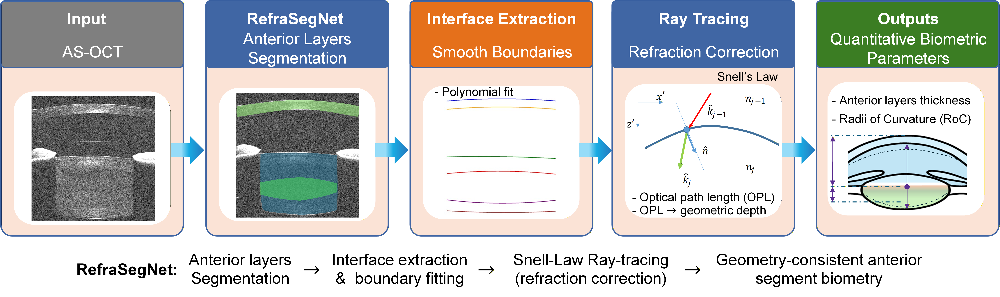
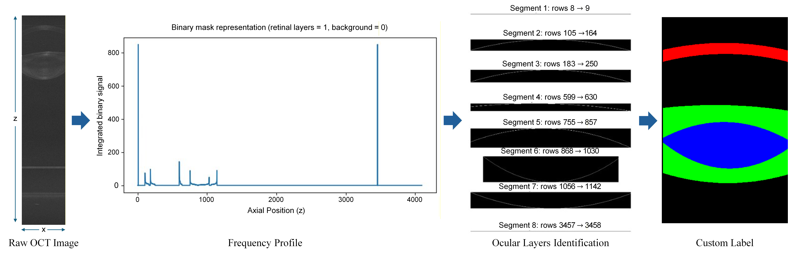
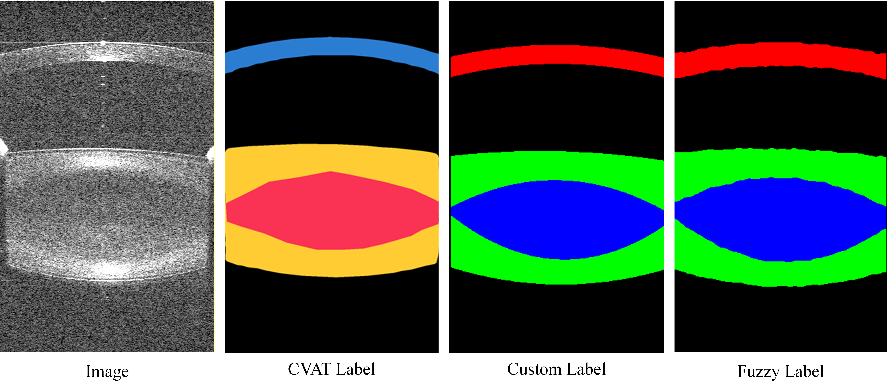

# RefraSegNet: OCT Image Segmentation Framework for Refraction Correction and Accurate Biometric Measurements of the Eye

This is the implementation of the RefraSegNet framework.

## Overview

This repository presents **RefraSegNet**, a refractive-aware deep learning framework for **annotation, segmentation, and biometric analysis** of anterior segment OCT (AS-OCT) images.

The pipeline performs:

- Precise **pixel-level segmentation** of the **cornea**, **lens**, and **lens nucleus**
- **Refraction correction** using physics-based ray tracing
- Extraction of **clinically relevant biometric measurements**

The framework is designed to handle challenges such as:

- Low image contrast
- Speckle noise
- Shadow artifacts
- Overlapping anatomical structures

## Graphical Abstract
The abstract representation of the proposed RefraSegNet framework is shown below.



## Key Features

- Custom pipeline for data annotation and preprocessing for anterior segment structures
- End-to-end pipeline from AS-OCT image segmentation to refraction-corrected biometric analysis
- Multi-class segmentation of cornea, lens, and lens nucleus
- Refractive-aware geometric correction using ray tracing
- Quantitative biometric measurement of thickness and curvature
- Fuzzy-label generation and training strategy

## Annotation Pipeline
### 1. CVAT Annotation

Initial annotations were generated using [CVAT](https://www.cvat.ai/).

**Limitations:**

- Low contrast boundaries
- Overlapping lens and nucleus regions
- Inconsistent manual labeling


### 2. Custom Annotation (LabVIEW Frequency Profiling)

To improve annotation quality:

- OCT intensity images are processed in LabVIEW
- High- and low-frequency vertical intensity profiles are extracted
- Boundary regions are detected using frequency transitions
- A Python post-processing script identifies segment boundaries

This approach significantly improves annotation precision compared to manual labeling. This annotation pipeline is shown in the image below.

<!--  -->


Image below represents the OCT image and corresponding labeled images using CVAT annotation, custom label technique, and fuzzy-label method.
<!--  -->


## Dataset Availability

- Data is available on request

## Installation

### Option 1: Conda environment from YAML

```bash
conda env create -f octseg.yml
conda activate octseg
```

### Option 2: Manual environment setup

```bash
conda create -n octseg python=3.10 -y
conda activate octseg
pip install -r requirements.txt
```

## Training

Run default training:

```bash
python train.py
```

Run k-fold training:

```bash
python train_kfold.py
```

## Example Results

Segmentation results on representative AS-OCT scans:


Example under partial occlusion (eyelashes/shadow artifacts):

<!--  -->


## Citation

If you use this code in your research, please cite the RefraSegNet paper:

```bibtex
@article{refrasegnet2026,
  title   = {RefraSegNet: OCT Image Segmentation Framework for Refraction Correction and Accurate Biometric Measurements of the Eye},
  author  = {Muhammad Usman, Keerthana Soman, Majad Mansoor, Ireneusz Grulkowski, Jacek RUMIŃSKI},
  journal = {under review},
  year    = {2026}
}
```

## Contact

For questions, collaboration, or data/model access requests:
- Muhammad Usman
- E-mail: [muhammad.usman1@pg.edu.pl](mailto:muhammad.usman1@pg.edu.pl)
- Gdansk University of Technology, FETI, Department of Biomedical Engineering, Gdansk, 80-233, Poland

