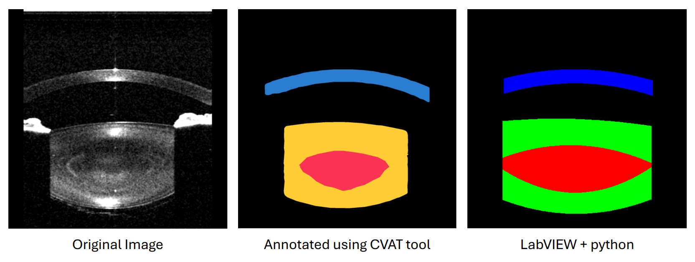
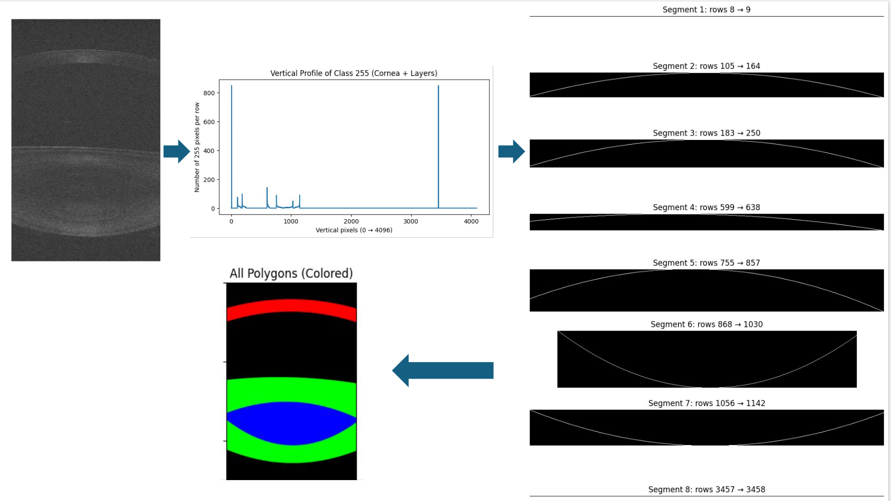

# OCT Image Segmentation: Cornea, Lens, and Nucleus

This repository provides a pipeline for precise **annotation** and **segmentation of OCT (Optical Coherence Tomography) images** into three key regions: **cornea**, **lens**, and **nucleus**.  
It combines a custom annotation method for precise boundary detection with a DeepLabV3+ U-Net model for automated segmentation.  
The approach addresses challenges such as **low image contrast** and **overlapping anatomical regions**, ensuring accurate delineation of structures.



---

## Annotation Pipeline

### CVAT for Annotation ([CVAT](https://www.cvat.ai/))
- Initial annotations were generated using CVAT.  
- Limitations: **low contrast**, **overlapping lens/nucleus regions**, and **imprecise boundaries**.

### Custom Annotation Tool (LabVIEW Frequency Profiling)
- OCT intensity images were processed in **LabVIEW** to extract **high- and low-frequency vertical profiles**.
- Vertical profiles were analyzed to detect **boundary regions** between anatomical layers.
- A **Python script** post-processed the profiles to identify **start and end points** for each segment:
  - Segments **2 & 3** → **Cornea**  
  - Segments **4 & 7** → **Lens**  
  - Segments **5 & 6** → **Nucleus**
- This method produces **precise and accurate annotations**, outperforming manual CVAT labeling.



---

## Model Training
A DeepLabV3+ U-Net model was trained on the **custom-annotated dataset** to segment OCT images into cornea, lens, and nucleus.

- **Input:** OCT images  
- **Output:** Segmentation masks (cornea, lens, nucleus)  
- **Architecture:** DeepLabV3+ with U-Net backbone for robust feature extraction and boundary prediction  
- **Data loading:** Custom PyTorch dataloader for preprocessing and training  

To train the model:
```bash
python train.py # configure paths, batch size, etc. in train.py
```
For k-fold cross-validation:
```bash
python train_kfold.py 
```

## Inference
Segment new OCT images using the pre-trained model:
```bash
python segment_oct.py 
```
---
## Installation

1. **Clone the Repository**:
   ```bash
   git clone https://github.com/yourusername/SegOCT_BioLab.git
   cd SegOCT_BioLab
   ```

2. **Set Up Virtual Environment**:
   ```bash
   conda create -n octseg 
   conda activate octseg
   ```

3. **Install Dependencies**:
   ```bash
   pip install -r requirements.txt
   ```

---
   ## Results
- **Visual Results**: Examples below show segmentation across different subjects.

| Subject | Segmentation Result |
|---------|--------------------|
| Subject 1 |  |
| Subject 2 |  |
| Subject 3 |  |
